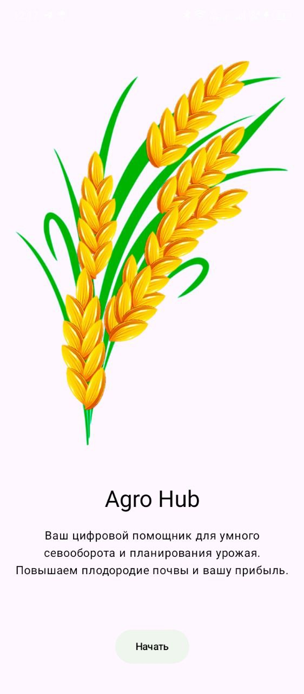
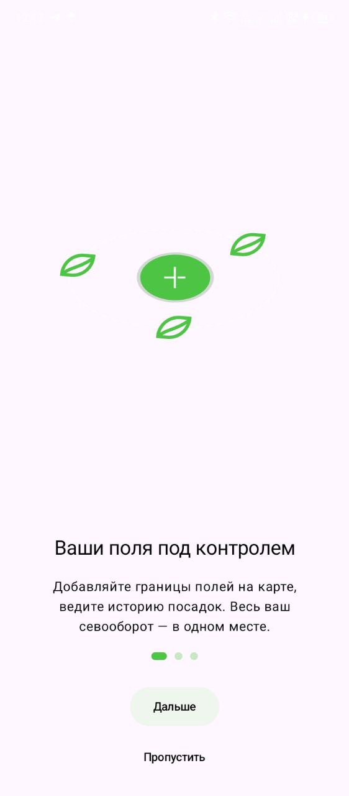
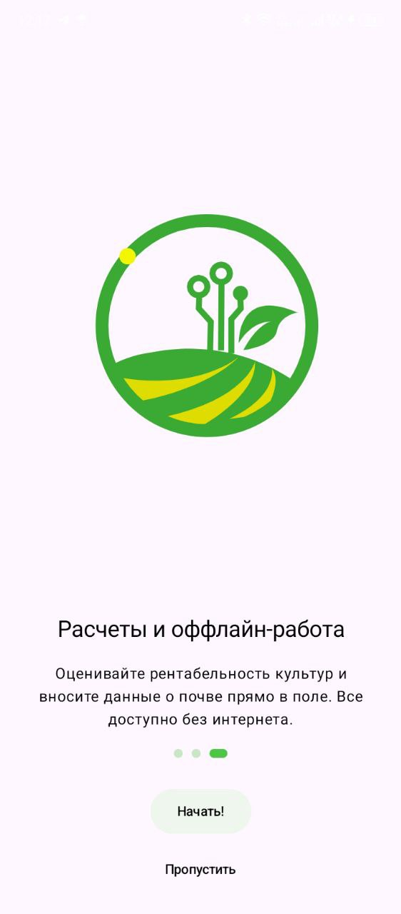
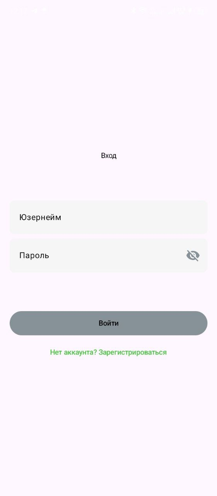
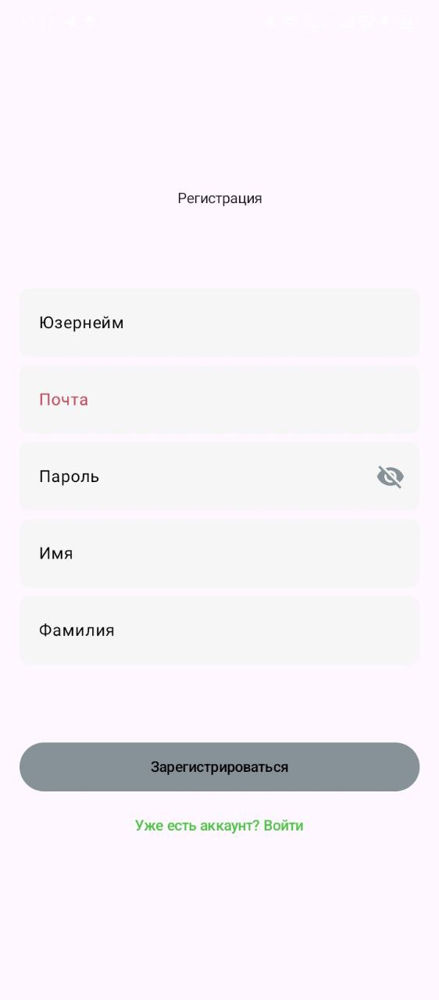
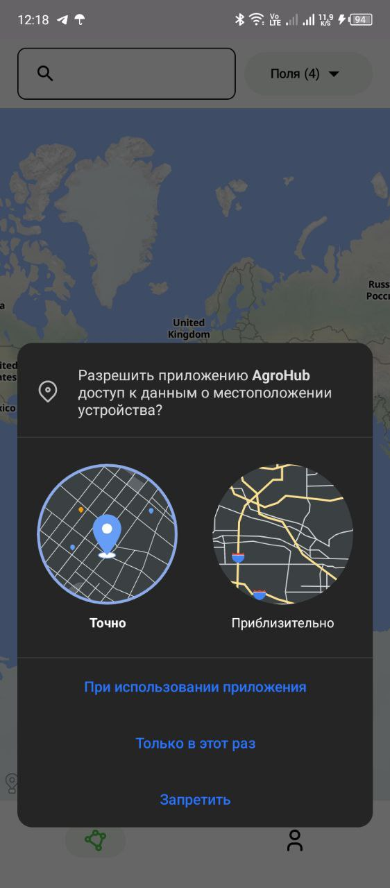
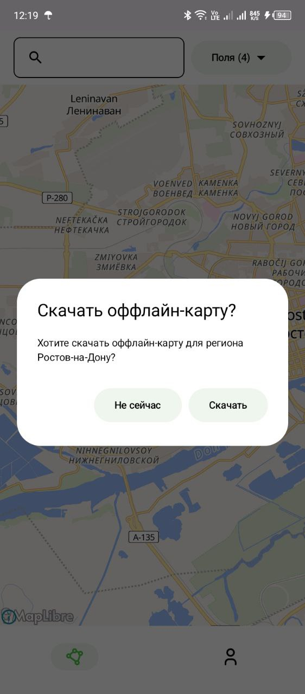
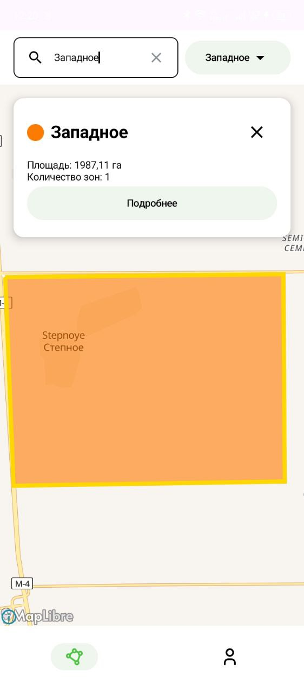
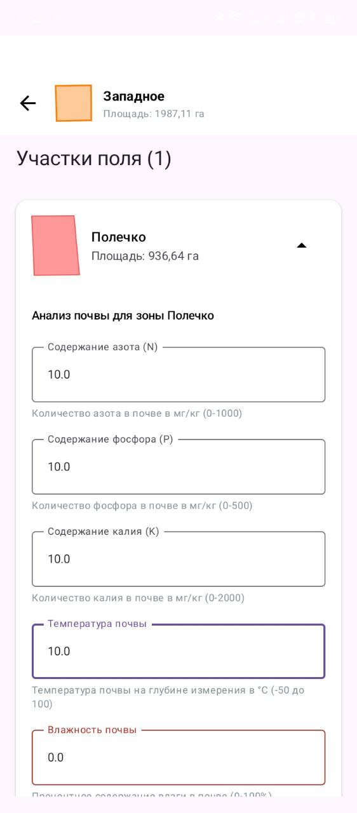
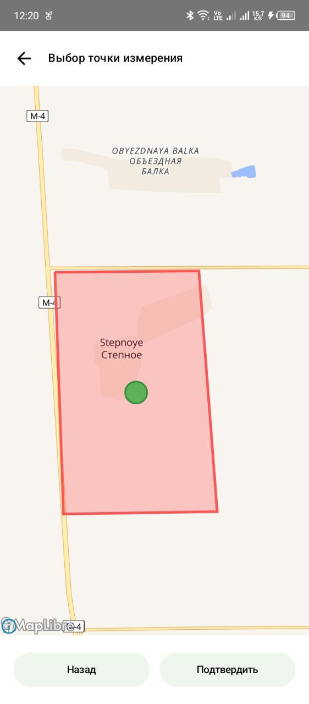

# AgroHub

---

## Оглавление
- [Описание](#описание)
- [Реализованные функции](#реализованные-функции)
- [Установка](#установка)

## Описание
**AgroHub** — продвинутое мобильное приложение для управления сельскохозяйственными угодьями с акцентом на оффлайн-работу и аналитику почвы. Приложение реализует полный цикл работы фермера: от планирования полей до анализа состояния почвы.

## Реализованные функции

### 🔐 Авторизация и профиль
- **Оффлайн-регистрация** - данные пользователя сохраняются локально и синхронизируются при появлении сети
- **JWT-аутентификация** с автоматическим обновлением токенов через TokenInterceptor и TokenAuthenticator
- **Управление профилем** с полной информацией об организации пользователя
- **DataStore с ProtoBuf** для безопасного хранения пользовательских данных и настроек

### 🗺️ Управление полями
- **Создание полей на карте** с рисованием полигонов в реальном времени
- **Offline-first подход** - все поля сохраняются в локальной БД Room
- **Иерархическая структура данных** - Field → Zone с отношениями один-ко-многим
- **Синхронизация данных** через WorkManager (FieldsSyncWorker)

### 🌱 Анализ почвы
- **Очередь запросов анализа** - SoilAnalysisQueueDao управляет отложенными анализами
- **Валидация точек отбора проб** с алгоритмом ray-casting для проверки принадлежности точки полигону
- **Фоновая обработка** через SoilAnalysisSyncWorker
- **Детальные отчеты** по химическому составу почвы

### 📍 Точечный анализ
- **Отдельный экран PointPickerActivity** для точного выбора точек анализа
- **Алгоритм проверки точки в полигоне** (PointInPolygonChecker)
- **Интерактивная карта** с возможностью выбора координат
- **Визуальная обратная связь** при выборе точек

### Структура и особенности кода
Проект использует паттерн **MVI**. Каждая функциональность оформлена отдельным пакетом (`auth`, `maplibre`, `soil_analyze`, `point_picker`, `profile`, `onboarding`) с подпакетами `data`, `domain` и `presentation` по чистой архитектуре.

- Пример файла `local.properties`, если захотите скачать и запустить проект:
```properties
    sdk.dir=...
    BASE_API_URL=https://example.api/
```

### 🎨 Кастомный UI/UX
- **Динамическая темизация** через кастомную систему цветов в `design_system/theme`
- **Адаптивные компоненты** - CustomSnackbar, PagerWithIndicator, анимированные кнопки
- **Lottie анимации** для загрузки и состояний пустых экранов
- **Кастомный SplashScreen** через отдельную SplashActivity с анимацией бренда

### 🧭 Навигация
- **Type-safe навигация** с sealed классами в Screens.kt
- **Анимированные переходы** через animatedTransition.kt
- **Bottom Navigation** для основных разделов приложения
- **Графы навигации** в Graphs.kt с четкой структурой

### 🔄 Синхронизация
- **WorkManager workers** - FieldsSyncWorker, SoilAnalysisSyncWorker
- **Очередь запросов** - SoilAnalysisQueueEntity с статусами (PENDING, SYNCED, ERROR)

### 🗃️ Data Management
- **Repository pattern** с разделением на локальные и удаленные источники
- **Single Source of Truth** - Room как основной источник данных для Полей
- **Reactive UI** через Flow и State в Compose

### 🗺️ MapLibre Integration
- Нативные компоненты **MapLibre Compose** для отображения карт
- **Оффлайн-регионы** - загрузка карт для работы без интернета
- Алгоритмы геопространственных вычислений - **ray-casting**, проверка пересечений
- **Permission handling** - запрос и проверка разрешений на местоположение
  
### 🔔 Notification System
**Уведомления** о статусе загрузки карт и анализов
- **Foreground services** - MapDownloadService, SoilAnalysisNotificationService
- **Progress notifications** с индикацией выполнения и другие уведомдления для оповещения пользователя
- **WorkManager** для периодических задач

## Скриншоты
<p align="center">
  
  
  
  
  
  
  
  
  
  
  
  
</p>

## Установка

<p align="center">Ссылка на текущую версию <a href="https://github.com/bybuss/WebAntPractice/releases/tag/v1.0.0">Releases</a></p>
<p align="center"><a href="https://cloud.mail.ru/public/9WYF/vHQB3bsvE">Ссылка на скачивание apk</a></p>
<p align="center"><a href="https://github.com/user-attachments/files/20852622/apk.zip">Прямая ссылка на установку .zip</a></p>
<p align="center"><a href="https://github.com/bybuss/WebAntPractice/blob/main/app/release/app-release.apk">Прямая ссылка на установку .apk</a></p>
